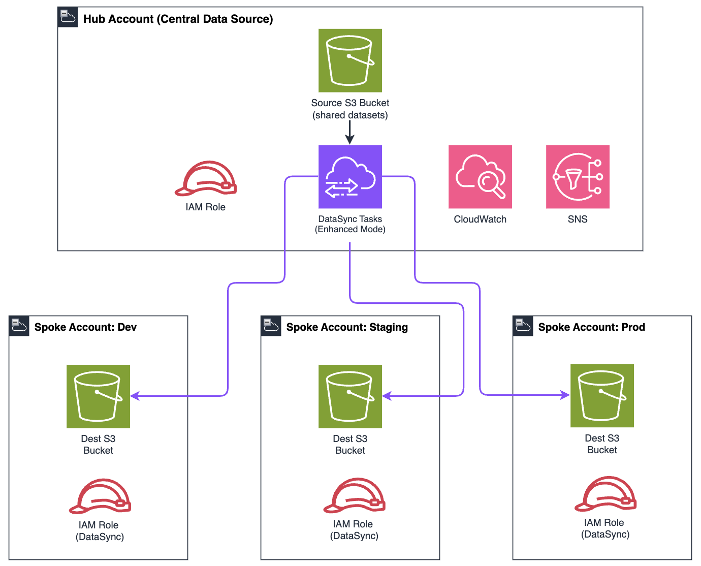

# Automated Cross-Account Data Distribution Hub

Distribute data from a central Amazon S3 bucket to multiple AWS accounts using [AWS DataSync](https://docs.aws.amazon.com/datasync/latest/userguide/what-is-datasync.html) Enhanced mode — fully automated with Terraform.

## Overview

This repository contains the Terraform configuration for a hub-and-spoke data distribution architecture that automates cross-account S3 data transfers. The hub account hosts the source S3 bucket and all DataSync tasks. Each spoke account contains a destination S3 bucket that receives data on a configurable schedule.

The solution provisions DataSync tasks (Enhanced mode), cross-account [IAM](https://docs.aws.amazon.com/IAM/latest/UserGuide/introduction.html) roles, destination bucket policies, [Amazon CloudWatch](https://docs.aws.amazon.com/AmazonCloudWatch/latest/monitoring/WhatIsCloudWatch.html) dashboards, and [Amazon SNS](https://docs.aws.amazon.com/sns/latest/dg/welcome.html) failure notifications from a single declarative configuration.

### Architecture



### How it works

1. DataSync tasks (one per spoke) run on a cron schedule in Enhanced mode.
2. Each task reads from the source S3 bucket and writes to the spoke's destination bucket.
3. The hub-side IAM role has read access to the source and write access to each destination (via spoke bucket policies).
4. [S3 Object Ownership](https://docs.aws.amazon.com/AmazonS3/latest/userguide/about-object-ownership.html) (`BucketOwnerEnforced`) ensures spoke accounts own all transferred objects.
5. CloudWatch EventBridge detects task failures and publishes to SNS for immediate alerting.
6. A centralized CloudWatch dashboard provides operational visibility across all spokes.

## Repository contents

```
.
├── README.md
├── SECURITY.md
├── LICENSE
└── terraform/
    ├── main.tf                    # Provider config, backend, SNS topic
    ├── variables.tf               # All input variables with descriptions
    ├── iam.tf                     # Hub-side DataSync IAM role and policies
    ├── datasync.tf                # Source/destination locations and tasks
    ├── monitoring.tf              # EventBridge rule, SNS target, CloudWatch dashboard
    ├── spoke_bucket_policy.tf     # Generated bucket policies for spoke accounts
    ├── outputs.tf                 # Task ARNs, role ARNs, dashboard URL, bucket policies
    └── terraform.tfvars.example   # Example variable values
```

## Prerequisites

**AWS**
- AWS account designated as the hub (central data source).
- One or more spoke AWS accounts with destination S3 buckets already created.
- Hub and spoke accounts should be part of the same [AWS Organization](https://docs.aws.amazon.com/organizations/latest/userguide/orgs_manage_ous_best_practices.html).
- IAM principal in the hub account with permissions to create DataSync, IAM, CloudWatch, and SNS resources.
- Source S3 bucket must already exist in the hub account.

**Terraform**
- Terraform >= 1.5.0
- AWS Provider >= 5.60.0 (for `task_mode = "ENHANCED"` support)

## Usage

### 1. Configure variables

```bash
cd terraform/
cp terraform.tfvars.example terraform.tfvars
```

Edit `terraform.tfvars` and replace placeholder values:

| Placeholder | Value |
|---|---|
| `source_bucket_arn` | ARN of your hub account's source S3 bucket |
| `hub_region` | AWS Region for hub resources (e.g., `us-east-1`) |
| `alert_email_addresses` | Email addresses for failure notifications |
| `spokes` | Map of spoke configurations (account ID, bucket ARN, schedule) |

### 2. Initialize and deploy

```bash
terraform init
terraform plan     # Review all resources that will be created
terraform apply    # Provision the infrastructure
```

### 3. Apply spoke bucket policies

After `terraform apply`, apply the generated bucket policies to each spoke's destination bucket:

```bash
# View the generated policies
terraform output spoke_bucket_policies

# In each spoke account, apply the policy
aws s3api put-bucket-policy \
  --bucket <DESTINATION_BUCKET_NAME> \
  --policy '<POLICY_JSON_FROM_OUTPUT>'
```

### 4. Configure S3 Object Ownership

In each spoke account, set Object Ownership to `BucketOwnerEnforced`:

```bash
aws s3api put-bucket-ownership-controls \
  --bucket <DESTINATION_BUCKET_NAME> \
  --ownership-controls 'Rules=[{ObjectOwnership=BucketOwnerEnforced}]'
```

### 5. Confirm SNS subscriptions

Each email recipient will receive a confirmation email from AWS. Subscriptions must be confirmed before failure notifications are delivered.

### 6. Validate with a test execution

```bash
# Get the task ARN from Terraform output
terraform output task_arns

# Trigger a one-time execution
aws datasync start-task-execution --task-arn <TASK_ARN>
```

## Adding a spoke

Add an entry to the `spokes` map in `terraform.tfvars`:

```hcl
new_team = {
  account_id = "555555555555"
  bucket_arn = "arn:aws:s3:::data-distribution-new-team"
  role_arn   = "arn:aws:iam::555555555555:role/TerraformProvisioningRole"
  schedule   = "cron(0 */4 * * ? *)"
}
```

Then run `terraform plan` and `terraform apply`. Apply the generated bucket policy to the new spoke's bucket.

## Removing a spoke

Delete the spoke entry from the `spokes` map and run `terraform apply`. This destroys the DataSync task, destination location, and associated IAM policies — cleanly revoking all cross-account access.

## Terraform resource details

| File | Resources created |
|---|---|
| `main.tf` | AWS provider, SNS topic, email subscriptions |
| `iam.tf` | DataSync service role, source bucket read policy, per-spoke destination write policies |
| `datasync.tf` | Source location, per-spoke destination locations, per-spoke Enhanced mode tasks with scheduling |
| `monitoring.tf` | EventBridge rule for task failures, SNS target, CloudWatch dashboard with per-spoke widgets |
| `spoke_bucket_policy.tf` | Generated IAM policy documents for spoke bucket policies (output as JSON) |
| `outputs.tf` | Role ARNs, task ARNs, location ARNs, SNS topic ARN, dashboard URL, bucket policies |

## Limitations

- DataSync Enhanced mode supports S3-to-S3 transfers. For EFS or FSx destinations, Basic mode with agents is required.
- Minimum scheduling interval is 1 hour using DataSync's built-in scheduler.
- The module generates spoke bucket policies but does not apply them automatically. Application requires access to each spoke account.
- Cross-region transfers incur standard AWS data transfer charges in addition to DataSync per-GB fees.

## Security

See [SECURITY.md](SECURITY.md) for production deployment guidance and accepted security considerations.

## Related resources

- [AWS DataSync User Guide](https://docs.aws.amazon.com/datasync/latest/userguide/what-is-datasync.html)
- [Choosing a DataSync Task Mode — Enhanced vs. Basic](https://docs.aws.amazon.com/datasync/latest/userguide/choosing-task-mode.html)
- [Tutorial: Transferring Data Between S3 Buckets Across AWS Accounts](https://docs.aws.amazon.com/datasync/latest/userguide/tutorial_s3-s3-cross-account-transfer.html)
- [Configuring How DataSync Verifies Data Integrity](https://docs.aws.amazon.com/datasync/latest/userguide/configure-data-verification-options.html)
- [Scheduling When Your DataSync Task Runs](https://docs.aws.amazon.com/datasync/latest/userguide/task-scheduling.html)
- [DataSync Include and Exclude Filters](https://docs.aws.amazon.com/datasync/latest/userguide/filtering.html)
- [AWS DataSync Pricing](https://aws.amazon.com/datasync/pricing/)
- [Terraform AWS Provider Documentation](https://registry.terraform.io/providers/hashicorp/aws/latest/docs)

## License

This project is licensed under the MIT-0 License. See the [LICENSE](LICENSE) file.
